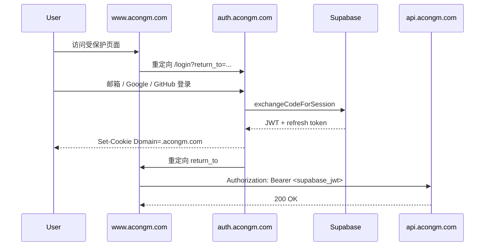

# OAuth / SSO 配置指南

本仓库实现 **独立 auth 子域 SSO 中转**（业界常见模式：Central Authentication Service）。

## 架构



## 技术选型

| 组件 | 选择 | 原因 |
| --- | --- | --- |
| 身份提供商 | **Supabase Auth** | 与 API `SUPABASE_JWT_SECRET` 校验一致 |
| SSR 集成 | `@supabase/ssr` | Next.js App Router 官方推荐 |
| 共享客户端 | `@acongm/auth-client` | portal/chat 复用 cookie + hooks |
| UI | Tailwind + Lucide | 轻量登录页，无 vendor lock-in |

## 登录方式

| 方式 | 状态 | 说明 |
| --- | --- | --- |
| 邮箱 + 密码 | 代码已接；Supabase Email 默认开启 | `/login` 表单登录/注册 |
| Google | 代码已接；需 Dashboard 启用 | OAuth，易接入 |
| GitHub | 代码已接；需 Dashboard 启用 | OAuth |

本地可先用**邮箱注册/登录**验收（`email: true`）。第三方需在 Supabase Providers 填入 Client ID/Secret。

## 多系统回跳（return_to）

各子系统跳转登录时应带上来源地址，登录成功后回到**来源站点**（`www`、`chat`、`auth` 等 `*.acongm.com` 均允许）：

```ts
import { getOAuthLoginUrl } from "@acongm/auth-client";

// 浏览器内会自动附带当前页 URL；也可显式传入
window.location.href = getOAuthLoginUrl({
  returnTo: window.location.href,
});
// → https://auth.acongm.com/login?return_to=https://www.acongm.com/...
```

| 场景 | 登录 URL | 登录后跳转 |
| --- | --- | --- |
| 从 `www.acongm.com` 点登录 | `?return_to=https://www.acongm.com/...` | 回到 www |
| 直接打开 `auth.acongm.com/login` | 无参数 | 回到 `https://auth.acongm.com` |
| 从 `chat.acongm.com` 点登录 | `?return_to=https://chat.acongm.com/...` | 回到 chat |

若未带 `return_to`，auth 登录页会尝试从 `document.referrer` 推断来源；OAuth 期间目标地址保存在 `acongm_auth_return_to` cookie 中。

## Supabase 控制台

### Email（手动账号）

1. **Authentication → Providers → Email**：保持 Enabled  
2. **本地开发强烈建议**：关闭 **Confirm email**，否则注册后无法立即登录（默认 SMTP 也只能给组织成员发信）  
3. 生产建议开启 Confirm email，并配置自定义 SMTP（Authentication → SMTP）  
4. 若已注册但未确认，可在 Dashboard → Authentication → Users 手动 Confirm，或用 SQL：

```sql
update auth.users
set email_confirmed_at = now()
where email = 'you@example.com';
```

### Google

1. [Google Cloud Console](https://console.cloud.google.com/apis/credentials) 创建 OAuth 客户端（Web）  
2. Authorized redirect URI：`https://ejprvntpxlyydkzsjqnv.supabase.co/auth/v1/callback`  
3. Supabase → **Providers → Google**：Enable，填入 Client ID / Secret  

### GitHub

1. **Authentication → Providers → GitHub**：启用并填入 GitHub OAuth App  
   - 若出现 `Unsupported provider: provider is not enabled`，说明 Provider 仍为关闭（与代码无关）  
   - 脚本：`scripts/configure-supabase-github-auth.sh`（可同时传 Google 凭证）  
2. **GitHub OAuth App Callback**：`https://<project>.supabase.co/auth/v1/callback`

### URL Configuration（必查）

> **Site URL 必须是线上 auth 域名。**  
> 若仍为 `http://localhost:3000`，第三方登录完成后会回跳到本地。

- **Site URL**: `https://auth.acongm.com`（不要用 localhost）
- Redirect URLs:
  - `https://auth.acongm.com/callback`
  - `https://auth.acongm.com/**`
  - `https://www.acongm.com/**`
  - `https://chat.acongm.com/**`
  - `http://localhost:3100/callback`（仅本地 auth 开发）

也可用脚本（需 `SUPABASE_ACCESS_TOKEN`）：

```bash
export SUPABASE_ACCESS_TOKEN=...   # https://supabase.com/dashboard/account/tokens
./scripts/configure-supabase-github-auth.sh
```

该脚本会把 `site_url` 设为 `https://auth.acongm.com` 并写入 Redirect allow list。
## Vercel 部署

**API 已部署后**，按 [docs/deploy-checklist.md](./docs/deploy-checklist.md) 部署本仓到 `auth.acongm.com`。

简要步骤：Vercel 导入本仓库 → Root Directory = `apps/auth` → 配置 Supabase 环境变量 → 绑定域名。

### 项目设置

| 项 | 值 |
| --- | --- |
| Root Directory | `apps/auth` |
| Framework | Next.js |
| Install Command | `cd ../.. && pnpm install` |
| Build Command | 见 `apps/auth/vercel.json` |

### 环境变量（Production）

```
NEXT_PUBLIC_SUPABASE_URL=
NEXT_PUBLIC_SUPABASE_ANON_KEY=
NEXT_PUBLIC_AUTH_COOKIE_DOMAIN=.acongm.com
```

本地开发设置 `NEXT_PUBLIC_AUTH_LOCAL=1` 以禁用跨域 cookie。

### 域名

在 Vercel Project → Settings → Domains 添加：

- `auth.acongm.com`

DNS（Cloudflare / 域名商）添加 CNAME：

```
auth.acongm.com -> cname.vercel-dns.com
```

### CLI 快速部署

```bash
pnpm install
pnpm build
cd apps/auth
vercel link
vercel env pull
vercel --prod
vercel domains add auth.acongm.com
```

## 子应用接入

```ts
import { getOAuthLoginUrl } from "@acongm/config";

const loginUrl = getOAuthLoginUrl({
  returnTo: window.location.href,
});

window.location.href = loginUrl;
```

登录后使用 `@acongm/auth-client` 读取 session，并将 access token 传给 API。

## 匿名 Thread 认领

```ts
import { claimAnonymousThreads, createBrowserClient } from "@acongm/auth-client";

const client = createBrowserClient();
const { data } = await client.auth.getSession();

await claimAnonymousThreads({
  apiBase: "https://api.acongm.com",
  clientId: "anon-client-id",
  accessToken: data.session!.access_token,
});
```

## 路由

| 路径 | 说明 |
| --- | --- |
| `/login` | SSO 登录页，支持 `?return_to=` |
| `/callback` | OAuth 回调，写入 `.acongm.com` cookie |
| `/logout` | 清除 session，可选 `?return_to=` |
| `/api/session` | 当前 session JSON |
